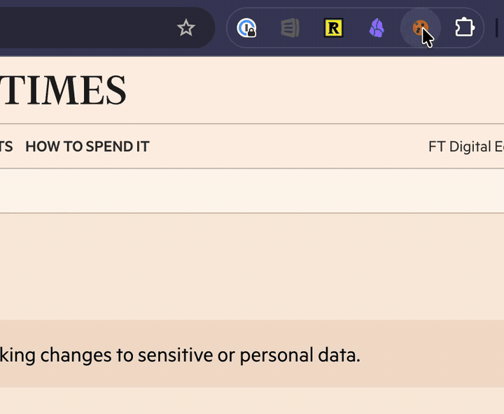

# 🍪 Cookie Jar

[](https://opensource.org/licenses/MIT)

> Transfer authenticated browser sessions to headless browsers by sending cookies from your real browser to automation scripts.



## The Problem

Headless browsers can't log into websites with:
- **CAPTCHAs** that detect automation
- **Two-factor authentication** (2FA)
- **Bot detection systems** that block headless browsers
- **Complex login flows** (OAuth, SSO, magic links)

This makes it nearly impossible to access authenticated content (paywalled news sites, financial data, internal tools) in your automation scripts, AI agents, or testing pipelines.

## The Solution

Cookie Jar lets you transfer your real browser session to headless browsers:

1. **Log in normally** in Chrome (solve the CAPTCHA, do the 2FA dance)
2. **Click the extension** to grab your authenticated cookies
3. **Send them to your server** where they're available to headless browsers
4. **Your scripts now have access** to the authenticated content

No more fighting with bot detection. No more manually solving CAPTCHAs in CI. Just use your real browser session.

## Architecture

```
┌─────────────────────┐
│  Chrome Extension   │  ← You log in here (with CAPTCHA, 2FA, etc.)
│   (Your Browser)    │
└──────────┬──────────┘
           │ HTTPS POST
           │ (domain + cookies + auth token)
           ▼
┌─────────────────────┐
│  Receiver Service   │  ← Runs on your server/laptop
│   (Node.js/Express) │  ← Saves cookies to files
│   Port 3333         │
└──────────┬──────────┘
           │ Exports cookies in multiple formats:
           │  • Playwright
           │  • Puppeteer
           │  • browser-use
           │  • Netscape (curl)
           │  • Raw JSON
           ▼
┌─────────────────────┐
│  Your Automation    │  ← Headless browsers, AI agents,
│  Scripts/Agents     │     testing pipelines, scrapers
└─────────────────────┘
```

## Use Cases

- **AI agents** accessing paywalled research (Financial Times, NYT, WSJ)
- **Web scraping** sites with complex authentication
- **Testing pipelines** for authenticated flows (without mocking)
- **Research tools** that need access to authenticated APIs
- **Automation scripts** for sites with bot detection

## AI Agent Integration

Cookie Jar was built to solve a key problem for AI agents: **accessing authenticated web content**. When your agent needs to read a paywalled article or access content behind a login, Cookie Jar provides the session cookies without the agent needing to handle CAPTCHAs, 2FA, or bot detection.

### OpenClaw

[OpenClaw](https://github.com/openclaw/openclaw) agents can use Cookie Jar out of the box. The receiver's site registry API tells the agent whether to use simple `curl` or a full headless browser for each domain:

```bash
# Agent checks the best strategy for a site
curl -H "Authorization: Bearer $COOKIE_JAR_TOKEN" \
  http://localhost:3333/api/sites/www.ft.com

# → {"access_method": "curl", "bot_protection": "none", ...}
```

See [AGENT.md](AGENT.md) for full agent integration docs, including per-site access strategies, cookie expiry handling, and troubleshooting.

### Any AI Agent Framework

Cookie Jar works with any agent that can make HTTP requests. The receiver exposes a simple REST API — fetch cookies, inject them into your browser automation tool of choice, and access authenticated content. Works with LangChain, CrewAI, AutoGPT, or any custom agent framework.

## Quick Start

### 1. Install the Receiver Service

```bash
git clone https://github.com/sud0n1m/cookie-jar.git
cd cookie-jar/receiver
./install.sh
```

The installer will:
- Install npm dependencies
- Generate a random auth token
- Set up the service to run on port 3333
- Display the auth token (save this!)

**Note:** The install script creates a macOS LaunchAgent. For Linux/Windows, see [Manual Setup](#manual-setup).

### 2. Install the Chrome Extension

**Option A: Self-configuring download (recommended)**

Once the receiver is running, open its setup page in Chrome:

```
http://localhost:3333/setup
```

Click **Download Extension**, unzip, and load it as an unpacked extension in `chrome://extensions/`. The extension comes pre-configured with your receiver URL and auth token — no manual setup needed.

**Option B: Load from source**

1. Open `chrome://extensions/`
2. Enable "Developer mode" (top right)
3. Click "Load unpacked" and select the `extension/` folder
4. Click the Cookie Jar icon → ⚙️ Settings
5. Enter receiver URL: `http://localhost:3333/api/cookies`
6. Paste the auth token from step 1

### 3. Use It

1. Visit a site and log in (e.g., ft.com)
2. Click the Cookie Jar extension icon 🍪
3. Review the domain and cookie count
4. Click "Send Cookies"
5. Get cookies in your scripts (see [Usage Examples](#usage-examples))

## Usage Examples

### Playwright

```javascript
const { chromium } = require('playwright');
const fs = require('fs');

const domain = 'www.ft.com';
const cookiesFile = `./receiver/cookies/${domain}.json`;
const cookieData = JSON.parse(fs.readFileSync(cookiesFile, 'utf8'));

const browser = await chromium.launch();
const context = await browser.newContext();

// Add cookies
await context.addCookies(cookieData.cookies);

const page = await context.newPage();
await page.goto(`https://${domain}`);
// You're now logged in!
```

Or fetch via API:

```javascript
const response = await fetch(`http://localhost:3333/api/cookies/${domain}?format=playwright`, {
  headers: { 'Authorization': 'Bearer YOUR_TOKEN' }
});
const { cookies } = await response.json();
await context.addCookies(cookies);
```

### Puppeteer

```javascript
const puppeteer = require('puppeteer');

const domain = 'www.washingtonpost.com';
const response = await fetch(`http://localhost:3333/api/cookies/${domain}?format=puppeteer`, {
  headers: { 'Authorization': 'Bearer YOUR_TOKEN' }
});
const { cookies } = await response.json();

const browser = await puppeteer.launch();
const page = await browser.newPage();
await page.setCookie(...cookies);
await page.goto(`https://${domain}`);
// Authenticated!
```

### curl (Netscape format)

```bash
domain="www.nytimes.com"
curl -H "Authorization: Bearer YOUR_TOKEN" \
  "http://localhost:3333/api/cookies/${domain}?format=netscape" \
  -o cookies.txt

curl -b cookies.txt https://www.nytimes.com/
```

### Raw JSON

```bash
curl -H "Authorization: Bearer YOUR_TOKEN" \
  http://localhost:3333/api/cookies/www.ft.com?format=raw
```

See the [`examples/`](examples/) directory for complete working scripts.

## API Reference

### `POST /api/cookies`

Send cookies from the extension.

**Auth:** Bearer token (required)

**Request:**
```json
{
  "domain": "www.ft.com",
  "cookies": [
    {
      "name": "session_id",
      "value": "abc123...",
      "domain": ".ft.com",
      "path": "/",
      "secure": true,
      "httpOnly": true,
      "sameSite": "lax"
    }
  ]
}
```

**Response:**
```json
{
  "success": true,
  "domain": "www.ft.com",
  "cookieCount": 12,
  "savedTo": "www.ft.com.json"
}
```

### `GET /api/cookies/:domain?format=<format>`

Retrieve saved cookies for a domain.

**Auth:** Bearer token (required)

**Formats:**
- `raw` (default) - Chrome's native cookie format
- `playwright` - Ready for `context.addCookies()`
- `puppeteer` - Ready for `page.setCookie()`
- `browser-use` - Ready for browser-use CLI import
- `netscape` - Classic cookies.txt format (for curl)

**Example:**
```bash
curl -H "Authorization: Bearer YOUR_TOKEN" \
  "http://localhost:3333/api/cookies/www.ft.com?format=playwright"
```

### `GET /api/status`

Health check (no auth required).

**Response:**
```json
{
  "status": "ok",
  "service": "cookie-jar-receiver",
  "cookiesDir": "/path/to/cookies",
  "timestamp": "2026-03-21T23:30:00.000Z"
}
```

## Project Structure

```
cookie-jar/
├── extension/              # Chrome extension
│   ├── manifest.json       # Extension manifest (V3)
│   ├── popup.html          # Popup UI
│   ├── popup.js            # Popup logic
│   ├── options.html        # Settings page
│   ├── options.js          # Settings logic
│   └── icons/              # Extension icons
│
├── receiver/               # Node.js receiver service
│   ├── server.js           # Express server
│   ├── package.json        # Dependencies
│   ├── install.sh          # macOS setup script
│   ├── cookies/            # Saved cookie files (gitignored)
│   └── logs/               # Service logs (gitignored)
│
├── examples/               # Usage examples
│   ├── playwright-example.js
│   ├── puppeteer-example.js
│   ├── curl-example.sh
│   └── browser-use-example.sh
│
└── README.md
```

## Security

Cookies are essentially passwords. A stolen session cookie grants the same access as knowing the user's credentials. Treat every part of this system accordingly.

### Network & Transport

- **Never expose the receiver to the public internet.** Run it on `localhost`, or access it over [Tailscale](https://tailscale.com/), WireGuard, an SSH tunnel, or another encrypted transport.
- **Plain HTTP is vulnerable to MITM.** The bearer token and cookie payloads are sent in cleartext over HTTP. You **must** use encrypted transport (VPN, SSH tunnel, or a reverse proxy with TLS) for anything beyond `localhost`.
- **Bearer token authenticates requests but does not encrypt them.** Transport encryption (TLS/VPN) is a separate layer — you need both.
- For non-VPN setups, consider running the receiver behind a reverse proxy (nginx, Caddy) with TLS termination.

### Stored Data

- **Cookie files are as sensitive as passwords.** The receiver writes them with restricted permissions (`0600` — owner read/write only), but the server process owner must be secured too.
- Never commit `cookies/*.json` or `.env` to git (both are gitignored by default).
- Rotate your bearer token periodically and after any suspected compromise.

### Extension

- **Load as an unpacked extension from source**, not from a store. This way you control exactly what runs in your browser.
- The extension is small enough to audit (~200 lines of JS across `popup.js` and `options.js`). **Read the source before installing.**
- The extension only sends cookies for the **current tab's domain** (principle of least privilege) — it never bulk-exports all browser cookies.

### Cookie Lifetime

- Session cookies expire when the browser closes; persistent cookies have an `expirationDate`. Stolen cookies therefore have a limited window of usefulness, but you should still treat any leak as a credential compromise.

### Summary Checklist

| Concern | Mitigation |
|---|---|
| Bearer token auth | Random 64-char token, generated at install |
| Transport encryption | Use Tailscale / WireGuard / SSH tunnel / TLS reverse proxy |
| File permissions | Cookie files written with mode `0600` |
| Extension trust | Load unpacked from source; audit the ~200 lines of JS |
| Cookie scope | Only current-tab domain sent, never all cookies |
| Data at rest | `cookies/` and `.env` gitignored; restrict server user |

## Manual Setup

If you're not on macOS or don't want to use the install script:

1. **Install dependencies:**
   ```bash
   cd receiver
   npm install
   ```

2. **Create `.env` file:**
   ```bash
   echo "COOKIE_JAR_TOKEN=$(openssl rand -hex 32)" > .env
   ```

3. **Run the receiver:**
   ```bash
   node server.js
   ```

For production, use a process manager like PM2, systemd, or Docker.

## Troubleshooting

### Extension can't send cookies

1. Check receiver is running:
   ```bash
   curl http://localhost:3333/api/status
   ```

2. Verify auth token in extension settings matches `.env`

3. Check browser console for errors (F12 → Console)

### Receiver returns 401/403

- Auth token mismatch. Re-check extension settings.
- Token not set in `.env` file.

### No cookies found for domain

- Make sure you're logged into the site before clicking the extension
- Extension only grabs cookies for the current tab's domain
- Some sites use different domains for auth cookies (e.g., `.ft.com` vs `www.ft.com`)

### Cookies don't work in headless browser

- Check cookie `domain` - some cookies need a leading dot (`.example.com`)
- Verify `secure` flag matches your URL scheme (HTTPS required for secure cookies)
- Check `sameSite` - may need to be `None` for cross-site usage

## Development

The extension uses vanilla JavaScript (no build tools) for simplicity.

**To modify the extension:**
1. Edit files in `extension/`
2. Reload in `chrome://extensions/` (click the refresh icon)
3. Test with a site

**To modify the receiver:**
1. Edit `receiver/server.js`
2. Restart the service (or use `nodemon` for auto-reload)

## Roadmap

- [ ] Firefox extension
- [ ] Safari extension
- [ ] Docker container for receiver
- [ ] Cookie rotation/expiration tracking
- [ ] Web UI for managing cookies
- [ ] Support for other browsers (Edge, Brave)

## Contributing

Contributions welcome! Please open an issue or PR.

## License

MIT - see [LICENSE](LICENSE) file for details.

## Acknowledgments

Built to solve the universal problem of accessing authenticated content in headless browsers. Inspired by frustrations with CAPTCHA-protected paywalls and bot detection systems.
